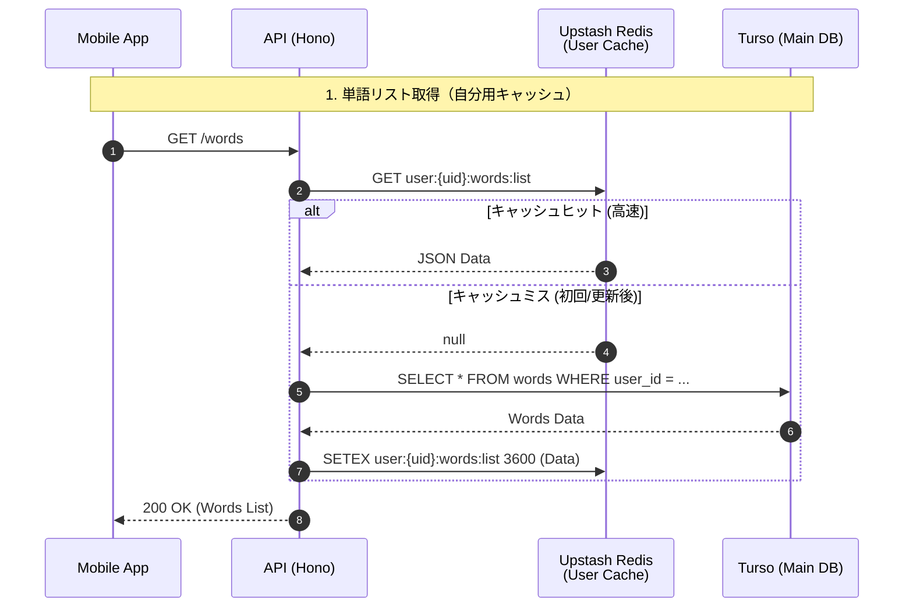
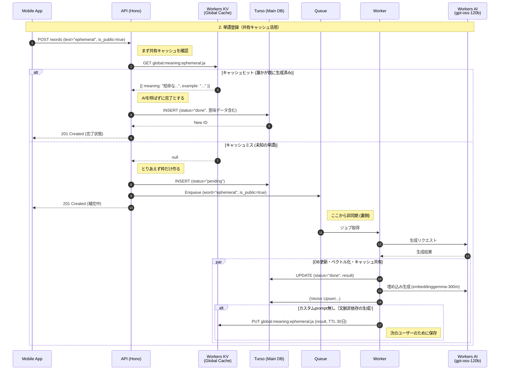
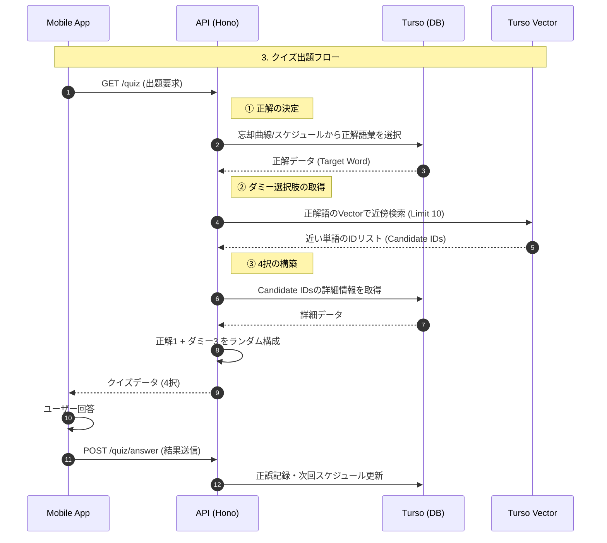
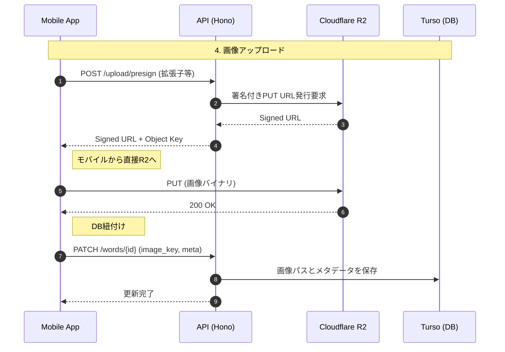

### 単語の取得

### 単語の追加

キャッシュをredis保存にしているがデータベースにした方がよい。

補足:

- AI（意味生成・埋め込み）は Workers AI バインディング経由（意味生成 `@cf/openai/gpt-oss-120b`、埋め込み `@cf/google/embeddinggemma-300m`・768次元）。外部APIキー不要。
- AI出力の共有キャッシュは Workers KV（`global:meaning:{word}:{lang}`）。Upstash Redis はレート制限・認証セッション用に残る。
- カスタムprompt付き・上書き指定（targets）付きの生成は文脈依存のため、共有キャッシュを読まない・書かない。

### 4択クイズ生成

### 画像アップロード

