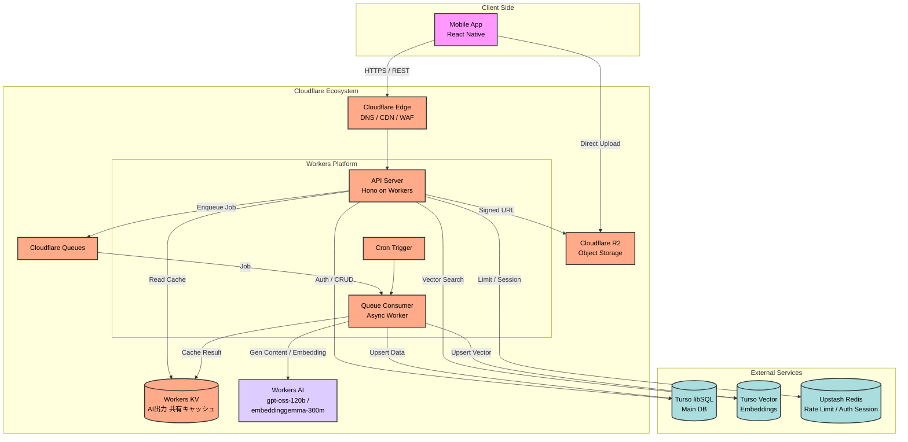

```mermaid
graph TB
    %% スタイル定義
    classDef client fill:#f9f,stroke:#333,stroke-width:2px,color:black;
    classDef cf fill:#fa8,stroke:#333,stroke-width:2px,color:black;
    classDef ext fill:#add,stroke:#333,stroke-width:2px,color:black;
    classDef ai fill:#dcf,stroke:#333,stroke-width:2px,color:black;

    %% クライアント
    subgraph Client [Client Side]
        Mobile[Mobile App<br/>React Native]:::client
    end

    %% Cloudflare エコシステム
    subgraph Cloudflare [Cloudflare Ecosystem]
        Edge[Cloudflare Edge<br/>DNS / CDN / WAF]:::cf

        subgraph Workers [Workers Platform]
            API[API Server<br/>Hono on Workers]:::cf
            Consumer[Queue Consumer<br/>Async Worker]:::cf
            Cron[Cron Trigger]:::cf
        end

        Queue[Cloudflare Queues]:::cf
        R2[Cloudflare R2<br/>Object Storage]:::cf
        KV[(Workers KV<br/>AI出力 共有キャッシュ)]:::cf
        WorkersAI[Workers AI<br/>gpt-oss-120b /<br/>embeddinggemma-300m]:::ai
    end

    %% 外部サービス
    subgraph External [External Services]
        DB[(Turso libSQL<br/>Main DB)]:::ext
        Vector[(Turso Vector<br/>Embeddings)]:::ext
        Redis[(Upstash Redis<br/>Rate Limit / Auth Session)]:::ext
    end

    %% 接続線
    Mobile -->|HTTPS / REST| Edge
    Mobile -->|Direct Upload| R2
    Edge --> API

    %% APIの責務
    API -->|Auth / CRUD| DB
    API -->|Vector Search| Vector
    API -->|Limit / Session| Redis
    API -->|Read Cache| KV
    API -->|Signed URL| R2
    API -->|Enqueue Job| Queue

    %% 非同期ワーカーの責務
    Queue --> |Job| Consumer
    Cron --> Consumer
    Consumer -->|Gen Content / Embedding| WorkersAI
    Consumer -->|Upsert Data| DB
    Consumer -->|Upsert Vector| Vector
    Consumer -->|Cache Result| KV
```
