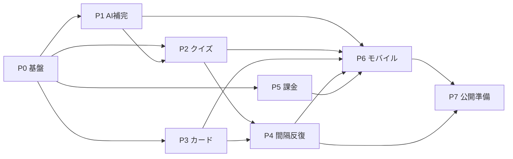

# Hudeato 開発ロードマップ

「言葉集め」体験を **集める → 楽に記録する → 想起する → 定着させる** の最小ループとして完成させ、**v1 公開（Web + モバイル）** に到達するまでのロードマップ。

- **ゴール**: v1 公開（ローンチ）
- **対象プラットフォーム**: Web（先行）＋ モバイル（Expo、Web の確定仕様を追従実装）
- **v1 コア機能**: AI補完 / 4択クイズ / フラッシュカード / 間隔反復 / 課金（全部入り）

各フェーズの詳細仕様は `Px-*.md` を参照。仕様の粒度は「目的 / スコープ / API仕様 / データモデル差分 / 主要UI / タスク / 完了条件 / 依存」の標準レベル。

---

## フェーズ一覧

| Phase | テーマ | 主眼 | 依存 | ファイル |
|---|---|---|---|---|
| **P0** | 基盤整備 | 学習データモデル・共通API土台・テスト/CI | — | [P0-foundation.md](./P0-foundation.md) |
| **P1** | AI補完 | 入力最小化（Gemini・非同期補完） | P0 | [P1-ai-completion.md](./P1-ai-completion.md) |
| **P2** | 4択クイズ | 想起（ベクトル検索ディストラクタ） | P0, P1 | [P2-quiz.md](./P2-quiz.md) |
| **P3** | フラッシュカード | 想起（スワイプ学習） | P0 | [P3-flashcard.md](./P3-flashcard.md) |
| **P4** | 間隔反復 | 定着（忘却曲線スケジューリング） | P2, P3 | [P4-spaced-repetition.md](./P4-spaced-repetition.md) |
| **P5** | 課金 | 収益（Polar・無料/有料） | P0 | [P5-billing.md](./P5-billing.md) |
| **P6** | モバイル移植 | 両プラットフォーム揃える | P1–P5 | [P6-mobile.md](./P6-mobile.md) |
| **P7** | 公開準備 | QA・性能・LP・デプロイ | P1–P6 | [P7-launch.md](./P7-launch.md) |

## 依存関係

## 進め方の方針

- **Web 先行 → モバイル追従**: 各機能は `API + Web` で作り切り、仕様が確定してから P6 で Expo に移植する。
- **基盤を上流に**: 学習データモデル（レビュー状態・履歴・ベクトル）は P0 で定義し、P2/P3/P4 が共有する。
- **AI補完を早期に**: AI が生成する意味・例文の品質がクイズのディストラクタやカード裏面に効くため P1 を前倒し。

## GitHub 運用

- **Issue 粒度**: タスク = 1 Issue（粒度 A）。
- **親Issue（エピック）**: フェーズごとに 1 本。`epic` ラベル。子Issueを `--parent` でぶら下げる。
- **ラベル**: `phase:P0`〜`phase:P7`、`epic`、領域は既存の `ai` / `server`（API）/ `webfront`（Web）/ `mobile` / `uiux` / `infra` を併用。
- 進捗は各親Issueのサブイシュー進捗バーで追う。本ファイルは設計の入口、GitHub は実行の管理。

## 進捗チェックリスト

- [ ] P0 基盤整備
- [ ] P1 AI補完
- [ ] P2 4択クイズ
- [ ] P3 フラッシュカード
- [ ] P4 間隔反復
- [ ] P5 課金
- [ ] P6 モバイル移植
- [ ] P7 公開準備
